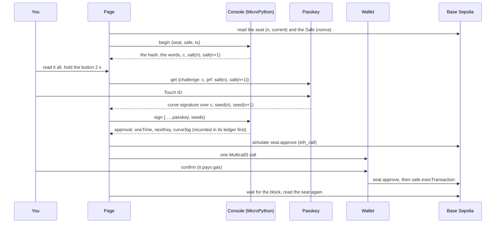

# One press, from button to block

What happens between holding the button and the key ladder moving up. Every step is in
`site/src/main.mjs` (`press`), and the e2e test runs it.

## Step by step

1. **Read the chain.** The seat's `n` and `current`, the Safe's nonce. Always fresh, before every
   signature.
2. **The console reviews.** It hashes the Safe transaction itself, says what it does, refuses what it
   can't explain, applies [the guardrail](guardrail.md), and builds `c` and the two salts. If key `n`
   already signed this same transaction, it hands back that approval to send again, and steps 3 to 5
   are skipped.
3. **You hold.** Two seconds. Red pages need a box ticked first. Reject is one press.
4. **One tap.** The passkey signs `c` and answers both salts ([the passkey](passkey.md)).
5. **The console signs.** It checks that the passkey signed exactly `c` with user verification, checks
   that `seed(n)` gives the seat's `current` (or refuses: another passkey, or another seat), makes
   `nextKey` from `seed(n+1)`, builds `m`, signs it with key `n`, and records the approval before
   answering.
6. **Ask the seat.** The page simulates `seat.approve` directly. Multicall3 would hide the seat's own
   error behind "call failed", so the seat is asked on its own.
7. **The wallet sends.** One Multicall3 `aggregate3` call with two parts:
   - `seat.approve(...)`, which must succeed;
   - `safe.execTransaction(...)` with the seat's vote as its signature (`r` = the seat, `s` = 0,
     `v` = 1), which may fail.
8. **The block.** The page reads the seat again and tells the console the chain's new `n`, which marks
   the approval landed.

## Why the Safe transaction may fail

If the Safe can't run the transaction yet (say it lacks the ETH), the approval still lands: the key
burns, the ladder moves, and the Safe keeps the seat's vote (`approvedHashes`). Anyone can run it
later. The other way round, a Safe transaction that could never run would block the seat at key `n`
forever, since key `n` may only ever send that one approval.

## Gas, worked out by the page

A wallet's gas estimate is the least gas with which nothing reverts. With the Safe transaction allowed
to fail, that is gas with which the Safe transaction fails: the approval lands, and the transfer
silently doesn't happen. The e2e test caught this. So the page estimates as if every part must
succeed, adds a quarter, and passes that to the wallet.

A wallet that sends through a smart account (EIP-7702, ERC-4337) may wrap the call and set the gas
itself. The first build on Base Sepolia went this way, through a delegation manager's
`redeemDelegations`. Whether such a wallet keeps the page's gas for a press is
[still to see](../testing/live.md).

## Who pays, and with what

Any wallet in the browser that speaks EIP-6963 or EIP-1193. The page lists them and you pick. It only
pays gas: nothing it signs approves anything in the Safe. A Trezor or a Ledger pays through a browser
wallet that drives it (Rabby, MetaMask, Frame). The device shows a call to Multicall3
(`0xcA11…CA11`); what the call approves is on the console's screen. WalletConnect isn't offered yet:
Trezor Suite's WalletConnect doesn't cover Base Sepolia (KICKOFF.md, open decisions).

## What the Safe needs

ETH for what it sends. A press of "Send 0.0001 ETH" needs 0.0001 ETH in the Safe; the gas comes from
the wallet. "Fund it" sends 0.001 test ETH from the wallet, enough for ten presses.
