# A phone signs; another wallet pays

Also available as a [PowerPoint walkthrough](onboarding-walkthrough.pptx), with editable text and
tables and the same paired screenshots and diagrams. Zoom in for small text inside the images.

A sample Sign and Burn onboarding, followed by three shielded transactions. The signing browser
keeps the passkey access and the console's ledger. A second browser holds the wallet that pays gas.
The wallet can belong to you or to someone helping you. It does not become an owner of the Safe.

**Test network only.** This walkthrough describes the current implementation and its limits. It
is not an audit or a claim of protection against a compromised device.

Each screenshot is paired with a diagram of the signing phone, its passkey and page memory,
the data disclosed outside the page, and the seat's state. Gold marks the passkey; violet marks
private seeds; blue marks public values; coral marks signed approvals; green marks the chain.
The phone prompts and physical objects are explanatory illustrations, not native dialogs. A public
value is not a private seed. Click a diagram to read it at full size.

## About these screenshots

These are screenshots of the running page at application commit `f13bf89`, captured on 2026-10-09. The signing browser is Chromium
at a phone width of 390 pixels, with no wallet and a virtual passkey. A separate browser context
plays the payer. Both use local Anvil, chain 31337, with the project's pinned Base Sepolia contract
bytecode. The published page uses Base Sepolia, chain 84532; the pictures therefore say Local Anvil.
All accounts and approvals shown are disposable test data. The local build changes the console
configuration, so its displayed fingerprint also differs from the published Base Sepolia image.

This is a phone-shaped browser rehearsal, not a test on an iPhone or Android device. The virtual
passkey handles the native dialogs automatically. The screenshots do not show Face ID, Touch ID,
a password manager dialog, or a real MetaMask confirmation. The buttons and screen states are real;
the appearance and PRF support of those native prompts depend on your browser and authenticator.
Recorded real-device checks are in [the live test table](testing/live.md).

## What you do, and when gas is needed

| Step | On the signing phone | On the payer's device | Gas paid? |
|---|---|---|---|
| Create passkey | Approve the native creation prompt | Nothing | No |
| Prepare key 0 | Approve a passkey assertion with a PRF output | Nothing | No |
| Deploy | Copy the build request; wait | Review, connect wallet, confirm deployment | Yes, from the wallet |
| Fund | Copy the Safe address or reuse the build link | Confirm a transfer into the Safe | Yes, plus the test ETH sent |
| Each shielded transfer | Review, hold, approve one passkey assertion; copy approval link | Review the same approval; confirm its send | Yes, from the wallet |
| Retry a refused send | Keep the same approval and ledger; no new passkey tap | Send that existing approval again | Only when a transaction is actually sent and included |

The Safe supplies the transfer amount. The payer supplies gas. If a usable wallet is on the phone,
connect it there and use the local Build or Send path instead of copying a link. The passkey,
PRF, console and disclosure order are the same; the extra payer browser is optional.

## First, which key is which?

“Signing exposes the private key” needs a distinction. Normal passkey use does not export the
passkey's private key. This application does receive other secret material through the PRF extension.

| Part | What it does | What the page or others can see |
|---|---|---|
| Passkey P-256 private key | Makes the WebAuthn curve signature | WebAuthn does not return it to the page. The authenticator or credential provider holds it. |
| Passkey P-256 public key | Lets Safe's passkey signer check that signature | Returned at passkey creation; public on-chain when its signer is deployed. It is not the rotating key. |
| Passkey PRF secret | Produces repeatable outputs for the requested salts | The page gets outputs, not this underlying secret. |
| `seed(n)` | Produces all 67 private hash-chain starting values for one-time key `n` | Returned to the signing page by the PRF. It passes through page and console memory. This is private signing material. |
| One-time signature | Authorizes this approval and its next fingerprint | Reveals 67 selected positions along the private hash chains. A position can be a chain's starting value. It does not disclose the whole seed. |
| Full one-time public key | The 67 hash-chain endpoints | Anyone with the message and one-time signature can compute these endpoints. |
| One-time fingerprint | Hash commitment to those endpoints, with their context | Stored on-chain before that key signs. It is not the full public key. |
| Gas wallet | Sends the prepared calls and pays their gas | Has its own account and keys. It is separate from the passkey and the seat's one-time keys. |

The passkey is used repeatedly. The one-time key is used for one approval only. The next sections
follow key 0, then key 1, then key 2.

## 1. On the phone: make the passkey

Press **Make a passkey**. Expect your browser or credential provider to ask where to create it and
to require user verification, such as a face, fingerprint or PIN.

| What the user sees | What happens behind it |
|---|---|
| 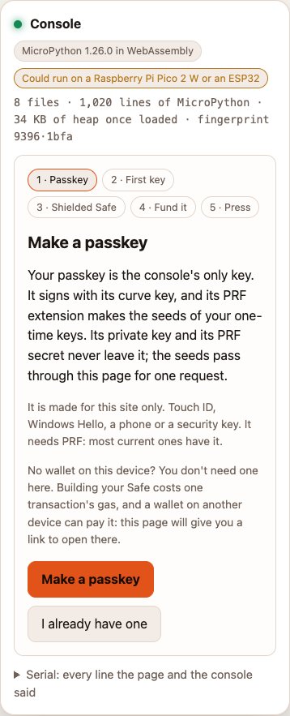 | [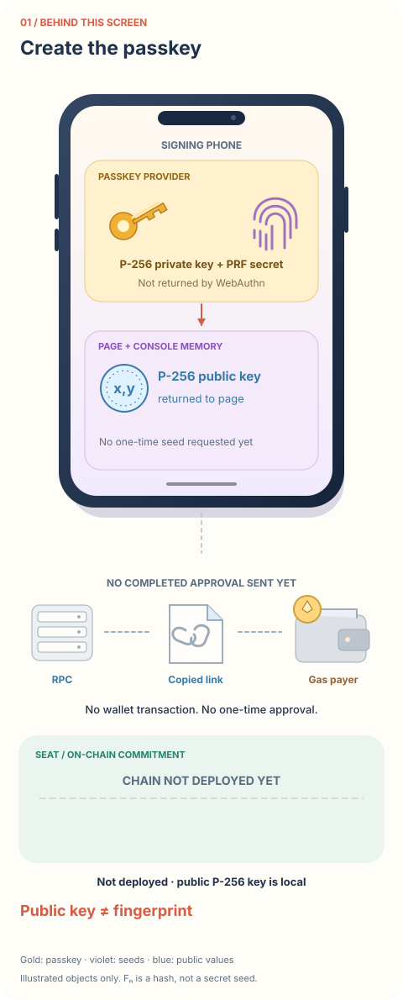](infographics/onboarding/01-phone-passkey.svg) |

The page calls `navigator.credentials.create({ publicKey: ... })`. It asks for P-256 (`alg: -7`),
a discoverable credential, required user verification and the `prf` extension. It records the
credential ID, public coordinates and site domain; it does not record the passkey private key.
The passkey belongs to the site's domain. A passkey made on localhost is not one for signandburn.app.

**Gas:** none. **On-chain change:** none. **Exposure:** the page receives the passkey public key and
credential metadata. No one-time approval has been made.

“I already have one” is a different path. The page asks for two ordinary WebAuthn assertions to
recover the existing passkey's P-256 public key. Those are not two signatures with a one-time key.
A synced passkey does not sync this application's ledger: do not alternate signing browsers for
one seat while an approval might be waiting.

## 2. On the phone: prepare the first one-time key

Press **Tap to make key 0**. This is another user-verification prompt, not a wallet transaction.

| What the user sees | What happens behind it |
|---|---|
| 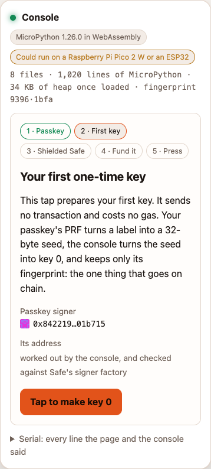 | [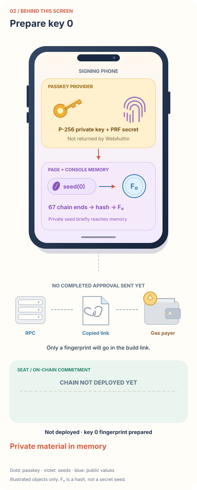](infographics/onboarding/02-phone-first-key.svg) |

The page calls `navigator.credentials.get({ publicKey: ... })` with a fresh challenge and one PRF
salt for key 0. The PRF returns `seed(0)`. The console derives 67 chain starts, hashes each to its
endpoint, then hashes the endpoints into key 0's fingerprint. The first-key setup uses the PRF
output; it does not make a one-time transaction signature.

**Gas:** none. **On-chain change:** none. **Exposure:** `seed(0)` is briefly in the signing page and
console. The browser record keeps the fingerprint and predicted addresses, not the seed.
A hostile page or extension able to read that memory could capture the seed at this point, before
any shielded transaction exists. Public-key disclosure is not the only exposure to consider.

A missing PRF result stops this path. Device support is something to test, not something a phone
screenshot establishes.

## 3. On the phone: give someone the build request

The addresses are worked out before deployment. **Connect a wallet** remains available. If this
phone has no wallet, press **Copy link** and send the plain URL to the person paying.

| What the user sees | What happens behind it |
|---|---|
| 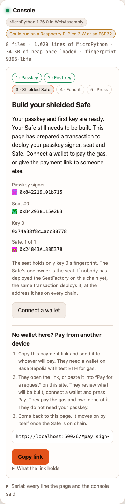 | [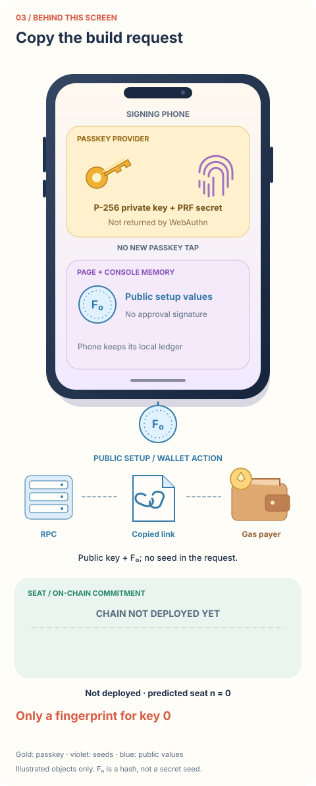](infographics/onboarding/03-phone-build-link.svg) |

This is an unsigned build request. It holds the passkey's public coordinates, seat number, key 0's
fingerprint and chain identifier. It does not contain a seed or a one-time approval signature.
The payer's page rebuilds the calls and addresses from those values rather than accepting arbitrary
calls from the link.

**Gas:** still none. **Exposure:** public setup values go to whoever receives the link, including
the messaging service used to send it. A build link is different from the signed approval link below.

## 4. On the payer's device: review, connect, deploy

The payer opens the link, or opens **Pay for a request** on this site and pastes it.

| What the user sees | What happens behind it |
|---|---|
| 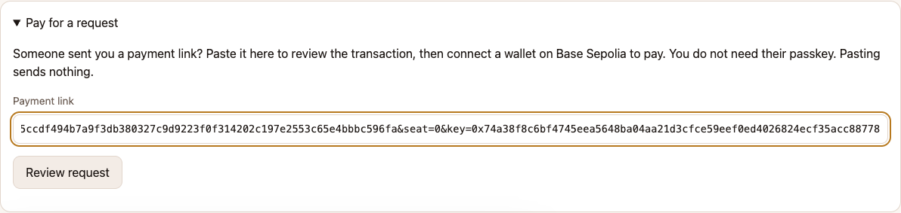 | [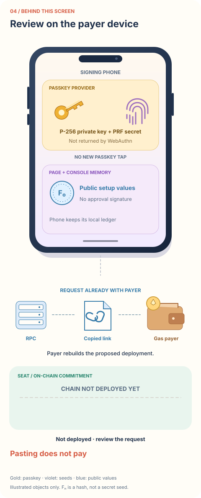](infographics/onboarding/04-payer-paste.svg) |

Pasting reviews the request here. It does not visit the pasted host or send a wallet transaction.
The payer connects a browser wallet. With multiple wallets, the page asks which to use.

| What the user sees | What happens behind it |
|---|---|
| 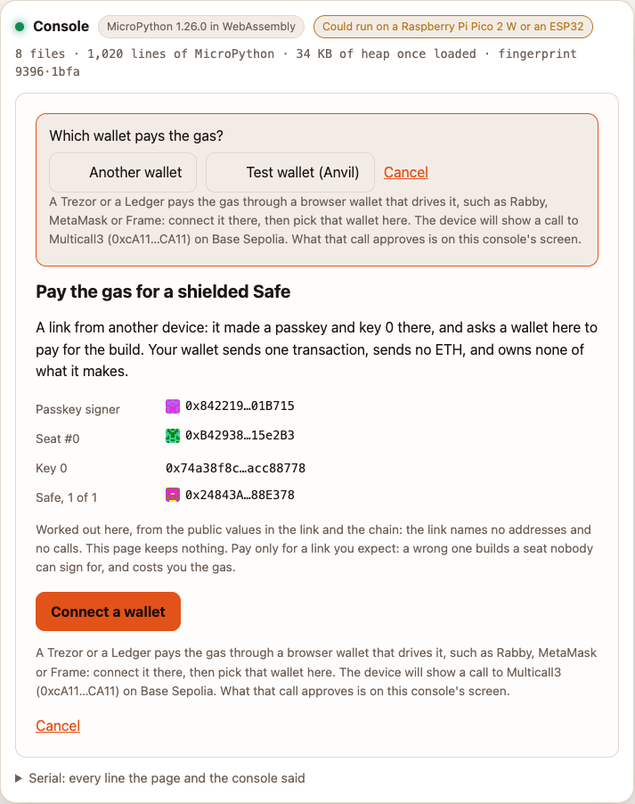 | [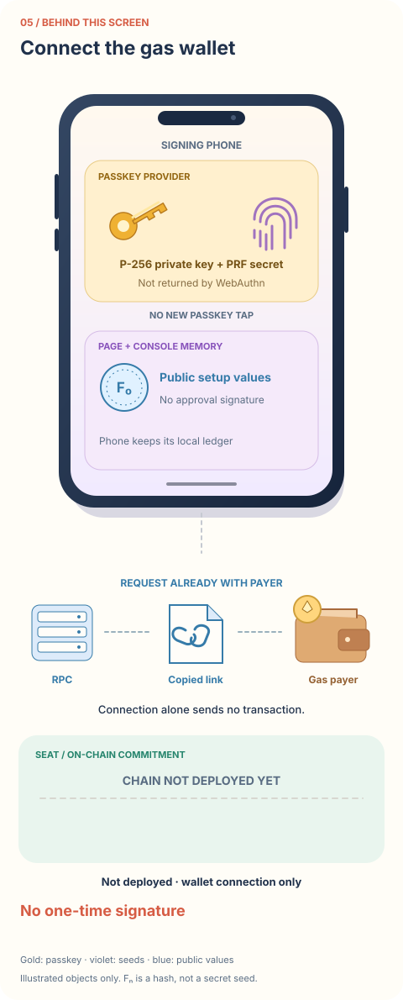](infographics/onboarding/05-payer-choose-wallet.svg) |

The payer checks the predicted Safe and seat, then presses **Pay: one transaction**.

| What the user sees | What happens behind it |
|---|---|
| 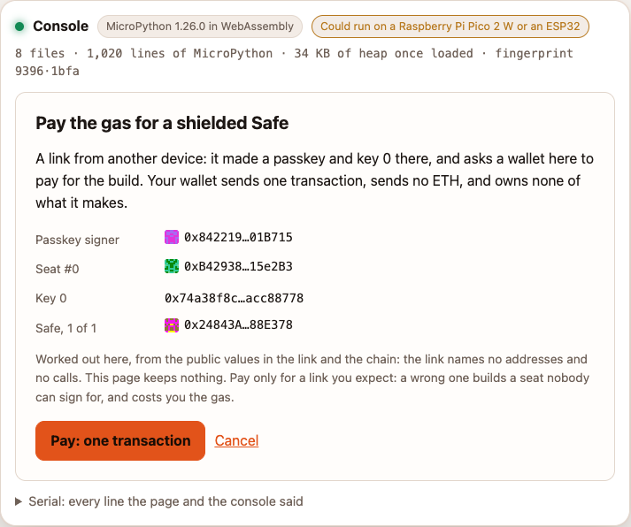 | [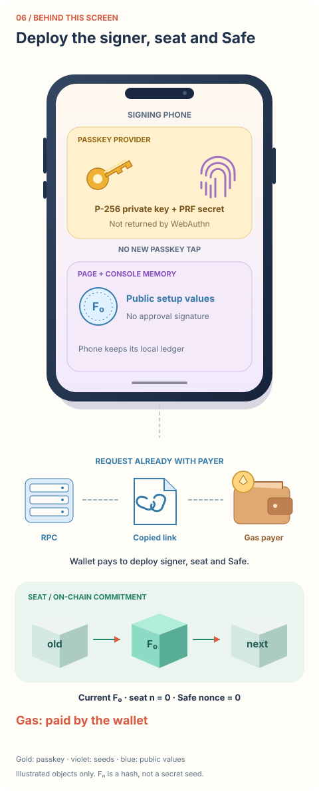](infographics/onboarding/06-payer-build.svg) |

Expect a separate wallet confirmation after pressing Pay. The payer needs Base Sepolia ETH for gas
on the published site. A Trezor or Ledger can be used through a browser wallet that drives it.
The stand-in wallet in these pictures is not a screenshot of MetaMask's confirmation.

The transaction deploys the passkey signer, seat and 1-of-1 Safe, plus the SeatFactory if needed.
Already deployed parts are skipped. The seat becomes the Safe's one owner. The payer owns none of it.

**Exposure:** the passkey P-256 public key is now public through its signer. The seat holds key 0's
fingerprint, not its full one-time public key. The gas account is a separate signer; a normal EOA
transaction signature also allows its public key to be recovered by those who receive it.

If the wallet says a request is already waiting, open it and finish or cancel the pending request,
then reconnect. A connection attempt does not send the deployment or approval transaction.

## 5. Put spending ETH in the Safe

Gas money and Safe money are separate. The payer's wallet pays transaction fees. The Safe needs
its own balance for the transfers it will make.

| What the user sees | What happens behind it |
|---|---|
| 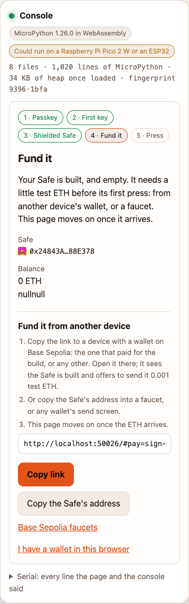 | [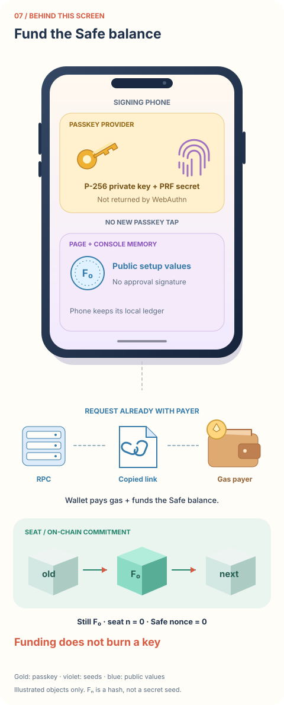](infographics/onboarding/07-phone-fund.svg) |

The stray `nullnull` text in this captured funding screen is a display bug, not transaction data.
The capture keeps it as shown by the page.

The payer can send **0.001 test ETH** to the Safe, or someone can send test ETH to its address by
another route. This is a separate wallet transaction, with its own gas. It does not consume a
one-time signing key. The phone watches the chain and moves on when the funds arrive.

## 6. First shielded transaction: key 0 sends 0.0001 test ETH

On the phone, enter the recipient and amount. Read the console's explanation and transaction hash.
Hold the button for two seconds. Reject remains a separate press.

| What the user sees | What happens behind it |
|---|---|
| 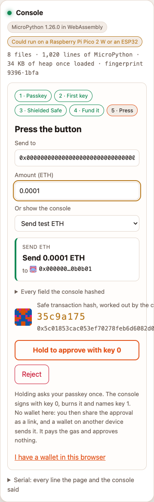 | [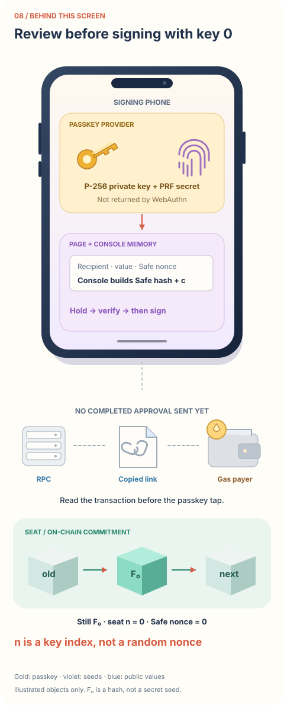](infographics/onboarding/09-phone-review.svg) |

The captured phone layout clips the long hash and some label text. The short check code is visible;
the desktop payer screenshot below shows the full hash. That clipping is a layout limitation of
the current page, not redaction applied to these screenshots.

At this point, no one-time signature for the transaction has been made. The console has built the
Safe transaction hash and challenge `c` from the displayed fields, chain, seat, Safe and key number.
It does not accept a precomputed hash supplied by the payer or wallet.

### What the passkey method returns

The application requests an assertion with two PRF outputs. This is the shape of the request;
it omits credential selection and byte conversion:

```js
navigator.credentials.get({
  publicKey: {
    rpId: siteDomain,
    challenge: c,
    userVerification: "required",
    extensions: {
      prf: { eval: { first: salt(0), second: salt(1) } }
    }
  }
});
```

The response has two different jobs:

1. A WebAuthn P-256 assertion. More precisely, the passkey signs authenticator data plus the
   SHA-256 hash of the client-data JSON, which contains challenge `c` and the origin. It does not
   simply sign the raw bytes of `c`.
2. PRF outputs `seed(0)` and `seed(1)`. These are private one-time signing material returned to the
   page. They are not the passkey private key, and they are not derived by recovering a secret
   from its P-256 signature.

The console checks the assertion's challenge and user-verification fields. It checks that
`seed(0)` produces the fingerprint the seat expects. It derives key 1's fingerprint from
`seed(1)`, builds `m` from `c` and that next fingerprint, and signs `m` with one-time key 0.
Only the one-time signature binds the next fingerprint in this v1 format; the P-256 challenge
does not include it. See [the open authorization question](research.md#1-complete-authorization).

The console records the signed approval in its ledger before returning it. Key 0 must never sign
another message, even though the chain still expects key 0 until the approval lands.
The application does not intentionally save or log seeds. Clearing references is not a proof that
all copies have been erased from JavaScript or WebAssembly memory.

### The signature leaves before the on-chain burn

The page sends the completed approval to the RPC for simulation. That call costs no gas and changes
no chain state, but it is a disclosure to the RPC operator. It includes the one-time signature and
the P-256 assertion. Anyone with the approval and its public context can compute the 67 one-time
public-key endpoints.

The phone then offers a signed payment link. It contains the signatures, next fingerprint and
transaction fields, not the seeds. The URL fragment is not sent in the ordinary request for the
page, but copying it into a message discloses it to the recipient and potentially the messaging
service. A fragment is not encrypted storage.

| What the user sees | What happens behind it |
|---|---|
| 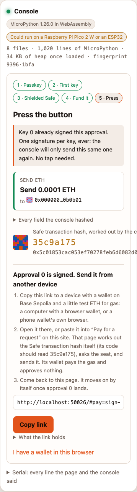 | [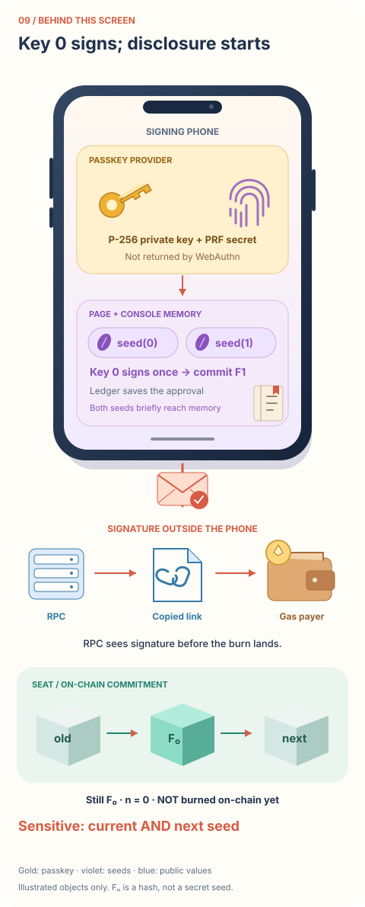](infographics/onboarding/10-phone-signed-link.svg) |

The payer opens that link. Their console computes the hash again from the fields; compare its
check code with the phone's. The payer's RPC receives the approval for simulation too.

| What the user sees | What happens behind it |
|---|---|
| 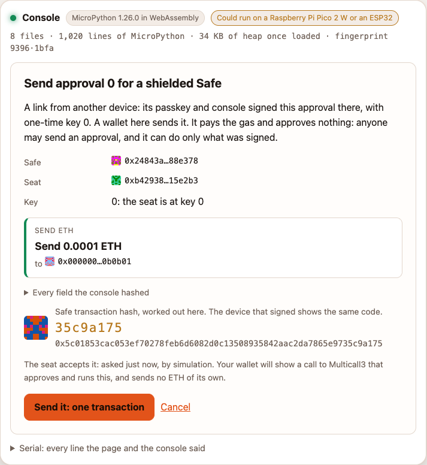 | [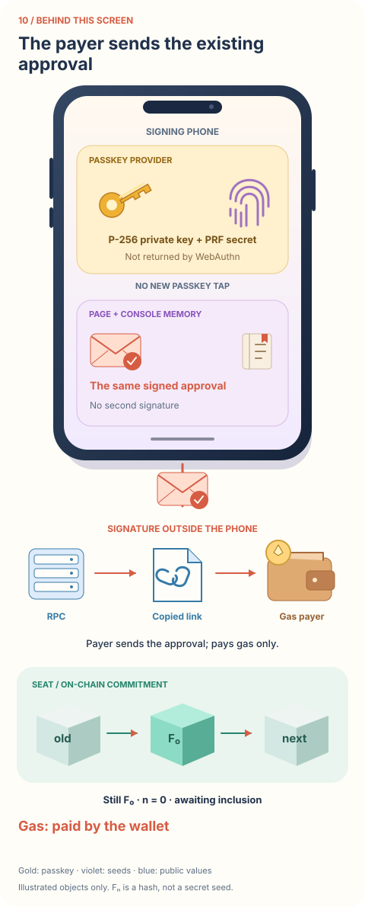](infographics/onboarding/11-payer-approval.svg) |

Pressing **Send it: one transaction** asks the payer's wallet to send a Multicall3 transaction.
The wallet pays gas; it does not make the seat's approval. The call approves with the seat and
tries to execute the Safe transaction.

Once the transaction is broadcast, its recipients can read the signatures. Do not assume every
network has a public mempool or that a private relay keeps transaction data private forever.
After inclusion, the signatures remain in on-chain transaction data.

When `Seat.approve` succeeds, it replaces key 0's fingerprint with key 1's and advances `n` to 1.
The example's Safe also runs the transfer. The phone sees this and displays the result.

| What the user sees | What happens behind it |
|---|---|
| 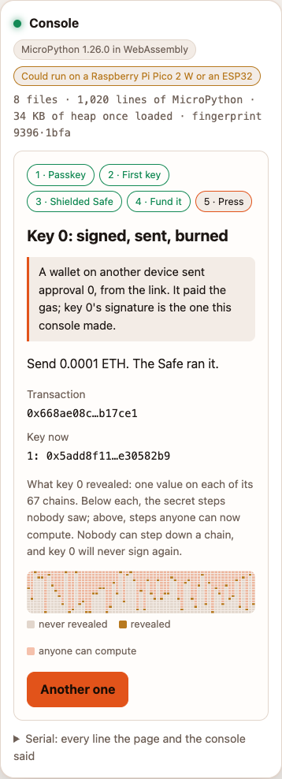 | [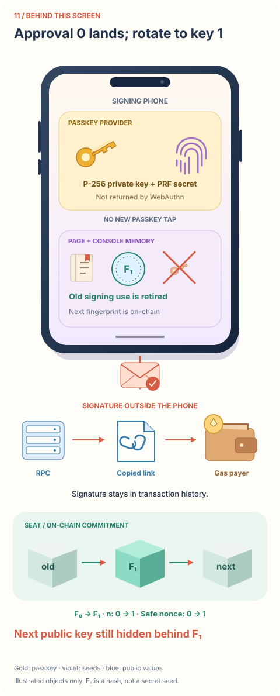](infographics/onboarding/12-phone-first-done.svg) |

## 7. Two more shielded transactions

The same phone remains the signer. The same other browser remains the payer. There is no deployment
step again. Each new approval gets one passkey assertion and one new pair of PRF outputs.

| Example | Safe sends | Key signs | PRF outputs returned to the phone | State after the approval lands |
|---|---|---|---|---|
| First | 0.0001 test ETH | 0 | `seed(0)`, `seed(1)` | Seat expects key 1; Safe nonce 1 |
| Second | 0.0002 test ETH | 1 | `seed(1)`, `seed(2)` | Seat expects key 2; Safe nonce 2 |
| Third | 0.0001 test ETH | 2 | `seed(2)`, `seed(3)` | Seat expects key 3; Safe nonce 3 |

The same method applies at key 27: the console reads `n = 27` from the seat, asks for PRF
outputs `seed(27)` and `seed(28)`, signs once with key 27, and commits key 28's fingerprint.
The seat advances to `n = 28` only when that approval lands. `n` is an approval index, not a
random nonce, and it is separate from the Safe transaction nonce.

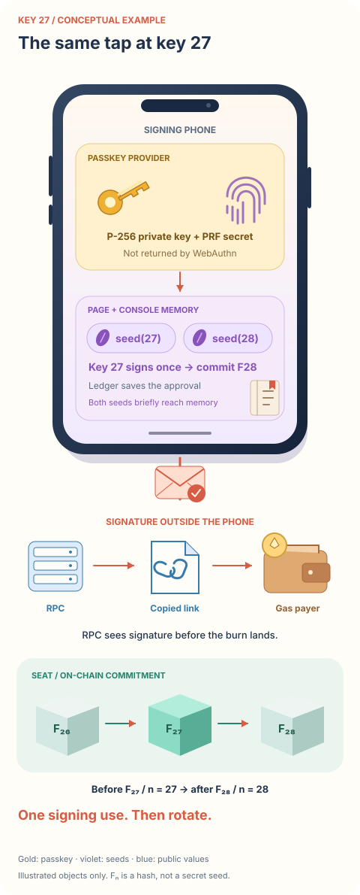

This diagram is a conceptual example, not an additional captured transaction.

This illustrates why the seeds are a separate risk: `seed(1)` is returned while approving with
key 0, then returned again when key 1 signs. The fingerprint of the next key hides its public key
from the chain; it does not hide that seed from a compromised signing page during the tap.

| What the user sees | What happens behind it |
|---|---|
| 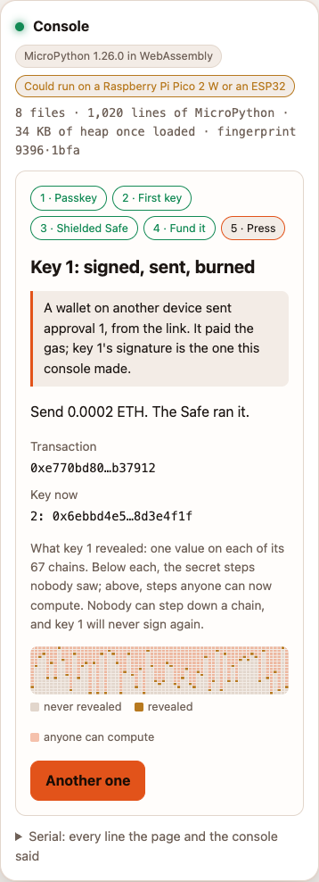 | [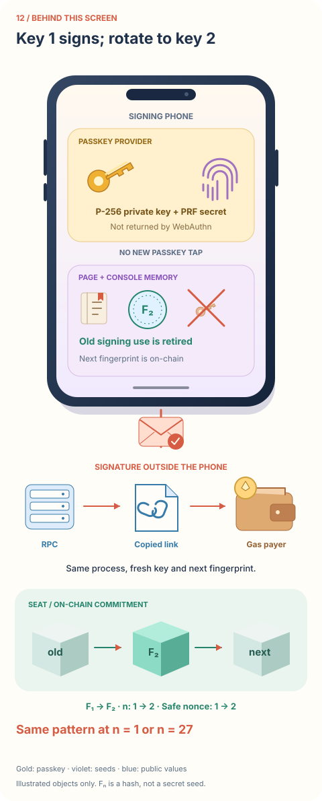](infographics/onboarding/14-phone-second-done.svg) |

For the third example, the payer rejects the wallet's send confirmation. The phone is reloaded.
It still offers approval 2, already signed. Reloading does not justify another signature or let
the user change this waiting approval. The payer retries the same approval without another tap
on the phone.

| What the user sees | What happens behind it |
|---|---|
| 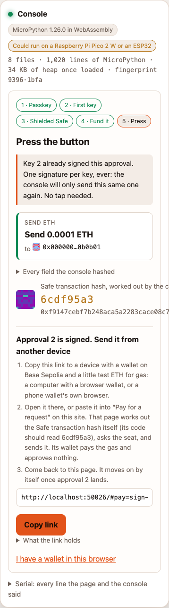 | [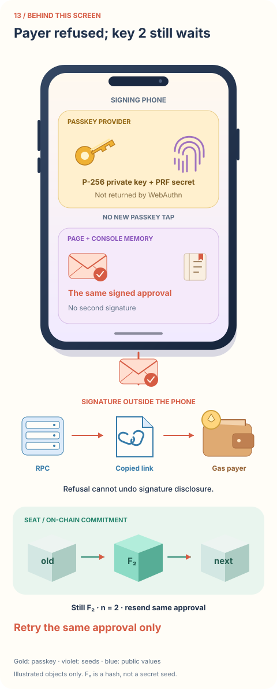](infographics/onboarding/13-phone-waiting-after-refusal.svg) |

After the payer accepts the retry, key 2 burns on-chain and the Safe makes the third transfer.
The three transfers total 0.0004 test ETH. With a starting Safe balance of 0.001, the Safe has
0.0006 test ETH left in this example. Gas was paid separately by the payer.

| What the user sees | What happens behind it |
|---|---|
| 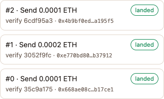 | [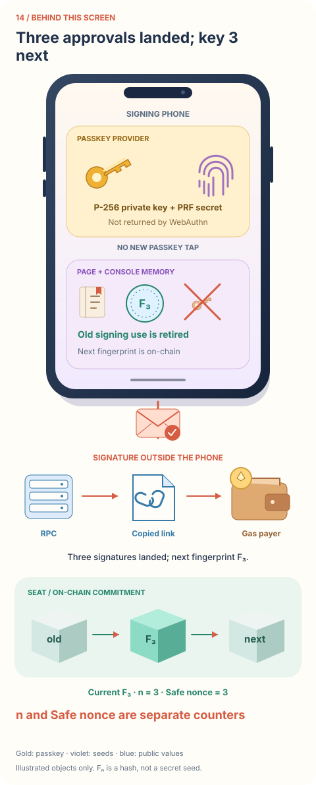](infographics/onboarding/16-phone-history.svg) |

A landed approval and a successful Safe execution are separate outcomes. The implementation can
burn the key and keep the seat's vote even if Safe execution fails. A payer's successful receipt
alone does not establish that the transfer ran. Check the page's execution result and Safe nonce.
The screenshots above show successful executions; the refusal did not land until retried.

## Where the theoretical exposures are

| Place or moment | What is exposed | What that means |
|---|---|---|
| Signing page after a PRF call | Current and, for an approval, next seeds; assertion; then the completed approval | Malware with access to this memory can steal private one-time material. This exceeds the intended public-signature exposure. |
| First-key setup | `seed(0)` briefly reaches the page | Seed exposure can precede any transaction approval. |
| Simulation RPC | Completed approval and transaction details | Gas-free does not mean private. The one-time public key can be computed before the burn lands. |
| Copied approval link, messaging service, payer or hypothetical relayer | Completed approval, transaction fields and next fingerprint | They can submit the existing approval. They do not receive seeds through the intended link format. No relayer service is built here. |
| Payer wallet and its transaction infrastructure | Calls and signatures submitted for broadcast | The approval is visible before inclusion. A compromised payer cannot be assumed to keep it private. |
| Included transaction | Signatures and transaction fields, permanently | The old key is retired on-chain if the approval succeeds. Only the next key's fingerprint is committed. |
| Cleared ledger or a second signing browser | The console can lose knowledge of an already disclosed signature | A second signature with the same one-time key can reveal more chain positions and enable forgery attempts. Reuse breaks the design's assumption. |
| Compromised OS, authenticator or synced credential account | Depends on what the attacker controls | An attacker may invoke the passkey or capture outputs. The application does not protect a compromised signing environment. |

There is no built-in expiry on the signed approval. Time between disclosure and inclusion can be
long, especially when a link is sent to another person. The console treats the key as used for
signing immediately; the seat retires it only when the approval lands. Keep the signing browser's
ledger, use one signing browser per seat, and resend the same waiting approval.

Revealing a public key is not ordinary private-key extraction. The theoretical curve-breaking
scenario concerns public curve keys; the passkey's P-256 public key is already public after its
signer is deployed. The one-time half is intended to require an additional hash-based signature.
It does not make the signing page trustworthy, and it does not protect the gas wallet's funds.

## Sources and limits

This walkthrough was checked against [passkey methods](../site/src/passkey.mjs),
[console signing and the ledger](../console/core.py), [the page's signing and simulation order](../site/src/main.mjs),
[payment links](../site/src/pay.mjs), [one-time key derivation](../reference/python/sign_and_burn.py),
and [the seat's checks and rotation](../contracts/src/Seat.sol).
The capture run checked one passkey assertion per fresh approval, three Safe executions,
key-number advances, and the same approval surviving refusal and reload. The native prompts,
real phone PRF support, a live MetaMask session and a real second-device flow were not tested here.
